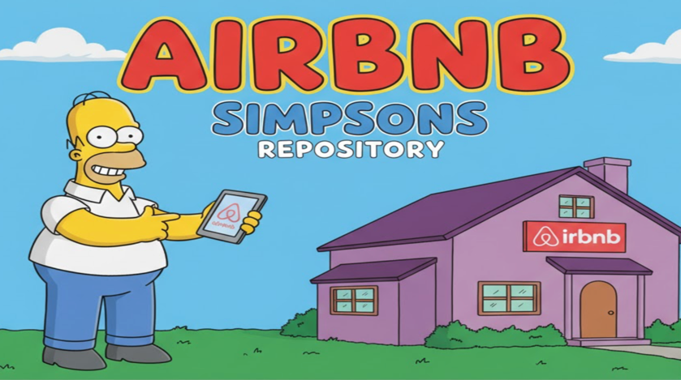

# Programación II

## Trabajo Práctico Final

------------------------------------------------------------------------

## Opción 3: Tema libre

El tema elegido es un sistema de gestion de alojamientos (Airbnb).

Por lo cual sera necesario cumplir con los siguientes requermientos:

---

### Gestión de usuarios

- [x] El sistema debe permitir **registrar** nuevos usuarios, solicitando los datos básicos (nombre, mail, contraseña, tipo de usuario).
- [x] El sistema debe permitir **iniciar sesión** y **cerrar sesión**.
- [x] El usuario podrá **actualizar su perfil** (nombre, mail, contraseña o teléfono).
- [x] Según el tipo de usuario:
    - [x] **Administrador**: podrá generar códigos de descuento, listar usuarios y ver pagos.
    - [x] **Anfitrión**: podrá gestionar sus alojamientos y ver las reservas asociadas.
    - [x] **Viajero**: podrá buscar, filtrar y reservar alojamientos, además de enviar reseñas.

---

### Gestión de alojamientos

- [x] Un **anfitrión** debe poder **agregar nuevos alojamientos**, definiendo dirección, tipo, nivel, descripción, precio por noche y fechas disponibles.
- [x] El sistema debe permitir **listar los alojamientos** existentes.
- [x] Los **viajeros** deben poder **buscar y filtrar alojamientos** según ciertos criterios (tipo, precio, disponibilidad, etc.).
- [x] Los usuarios podrán **ver las reseñas** asociadas a cada alojamiento.

---

### Gestión de reservas

- [x] Un **viajero** podrá **crear una reserva**, seleccionando un alojamiento, las fechas de inicio y fin, y confirmando el pago.
- [x] El sistema debe calcular el **costo total** según el precio por noche y los días reservados.
- [x] El viajero podrá **cancelar una reserva existente**.
- [x] El sistema debe permitir **ver el detalle de una reserva** y **cambiar el destino** si aún está pendiente.

---

### Gestión de pagos

- [x] El sistema debe permitir **procesar un pago** al confirmar una reserva.
- [x] El pago podrá tener diferentes **estados**: *Pendiente*, *Aprobado* o *Rechazado*.
- [x] El administrador podrá **listar todos los pagos realizados** en el sistema.

---

### Códigos de descuento

- [x] El **administrador** podrá **crear nuevos códigos de descuento**, indicando monto, porcentaje y fecha de expiración.
- [x] Los **viajeros** podrán **aplicar un código de descuento** al momento de realizar una reserva, siempre que esté disponible y no vencido.

---

### Reseñas

- [x] Los **viajeros** podrán **enviar reseñas** sobre un alojamiento o anfitrión luego de una reserva.
- [x] Cada reseña debe contener un puntaje, comentario, autor y fecha.
- [x] Los usuarios podrán **ver o eliminar** reseñas asociadas a un alojamiento o a su perfil.

---

### Flujo básico de ejecución del Main

El método `main()` deberá simular un flujo típico de uso del sistema:

- [x] **Registro e inicio de sesión de usuarios** (Administrador, Anfitrión y Viajero).
- [x] **Creación de alojamientos** por parte del anfitrión.
- [x] **Búsqueda de alojamientos** y **creación de una reserva** por parte del viajero.
- [x] **Aplicación de un código de descuento** y **procesamiento del pago**.
- [x] **Confirmación o cancelación de la reserva**.
- [x] **Envío de una reseña** sobre el alojamiento.
- [x] **Listados y consultas** de datos generales (usuarios, pagos, reservas, reseñas).

---

------------------------------------------------------------------------

### Requisitos y conceptos obligatorios / opcionales

Durante el desarrollo del trabajo deberán implementarse los conceptos
aprendidos durante el cuatrimestre.

#### **Obligatorios**

- [x]   **Diagrama UML** del sistema.
- [x]   **Uso de los 4 pilares de la POO:**
    - [x]  Herencia
    - [x]   Polimorfismo
    - [x]   Abstracción
    - [x]   Encapsulamiento
- [x]   **Mínimo 5 clases** (sin contar la clase `Main`, interfaces ni
    excepciones).
- [x]   **1 clase abstracta** y **1 interfaz**.
- [x]   **Uso de Listas / Arreglos / Colecciones.**
- [x]   **Manejo de errores** con al menos **2 clases de excepción
    personalizadas.**
- [x]   **Clase genérica.**
- [x]   **Persistencia de datos** mediante archivos (texto, binarios o
    JSON).

#### **Deseable**

- [x]  Uso de **GIT y GITHUB** para el versionado y trabajo colaborativo.

#### **Opcional**

- [ ]   **Interfaz gráfica (GUI)** con **JavaFX.**

------------------------------------------------------------------------

### Trabajo en equipo

- [x]  Todos los integrantes del grupo deben **commitear sus cambios** a
    medida que suben funcionalidades o corrigen código.
- [x]  No se aceptará un único commit con todo el código o que solo una
    persona haya subido el trabajo completo.
- [x]  **Todo el código fuente debe estar documentado** y comentado
    adecuadamente.

------------------------------------------------------------------------

